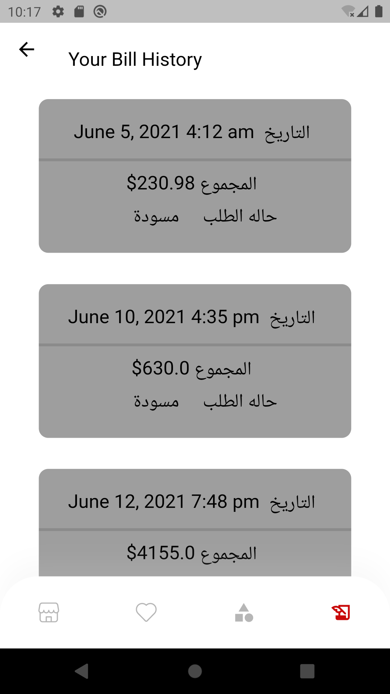

# Shopping_Show

## Getting Started

### Screenshots

<a href="https://play.google.com/store/apps/details?id=com.anany.panda1">

  
     <table><tr>
  <td style="text-align: center">
  <a href="https://play.google.com/store/apps/details?id=com.anany.panda1">
  

### introduction_screen:
### firebase_core:
### firebase_auth:
### google_sign_in:
### http:
###  firebase_storage:
### cloud_firestore:
### firebase_messaging:
### flutter_svg:
### flutter_rating_bar:
### google_mobile_ads:
###  sqflite:
### simple_animations:
###  flutter_automation:
###  flutter_riverpod:
### flutter_card_swipper:
### image_picker:
###  websafe_svg:

