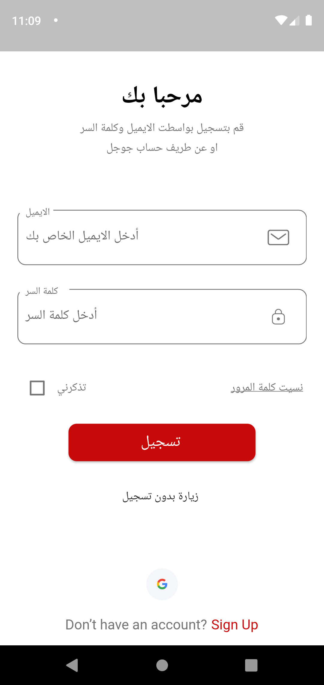
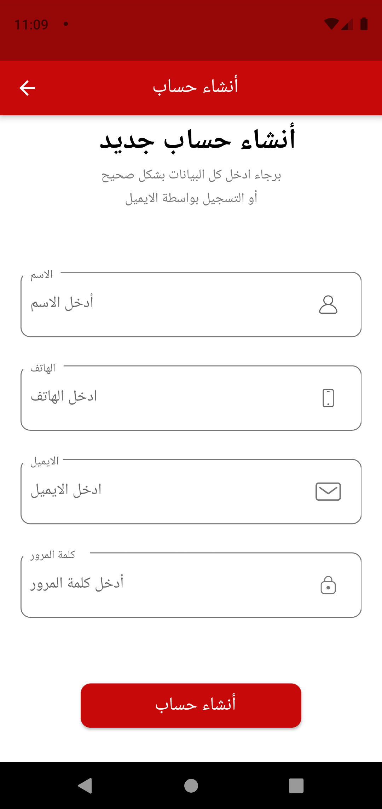
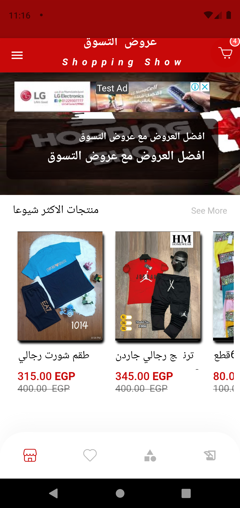
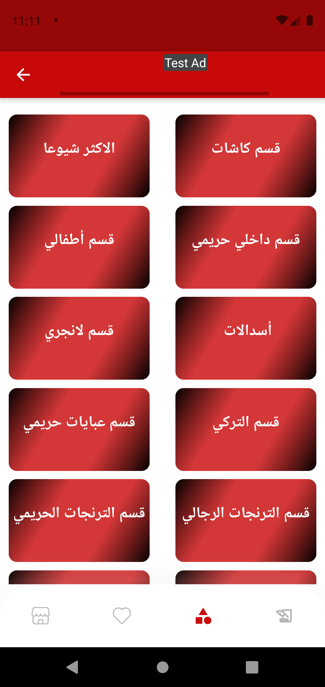
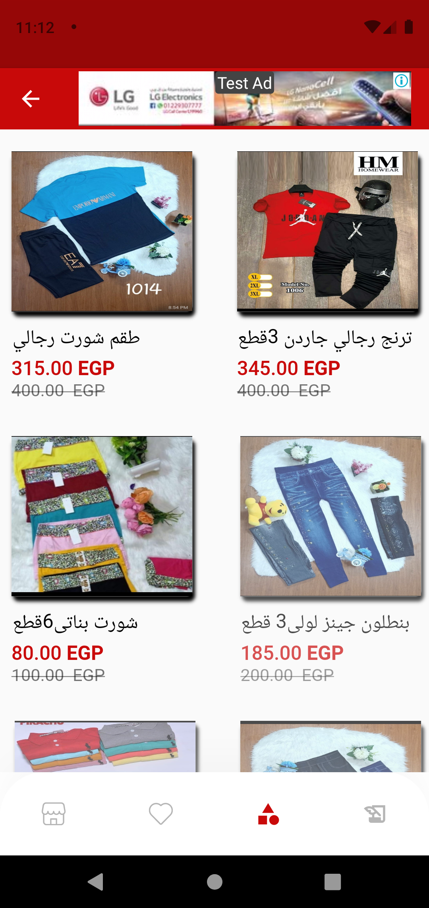
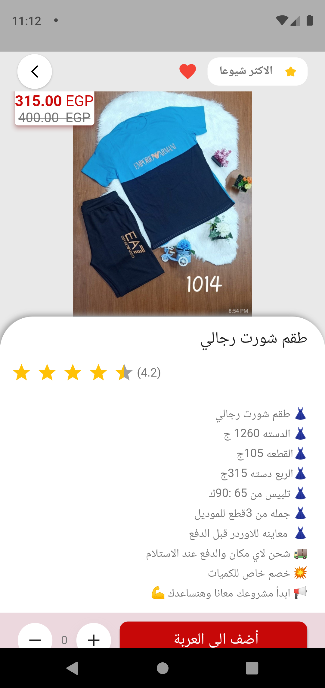
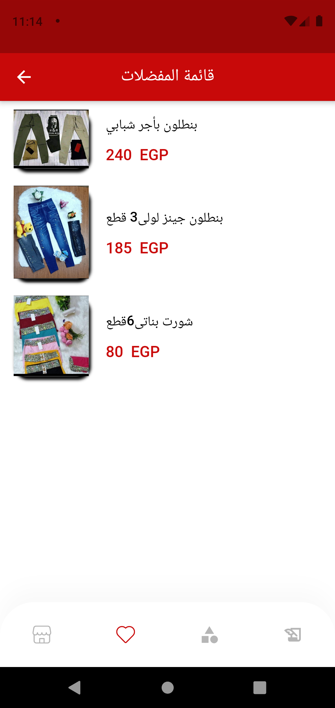
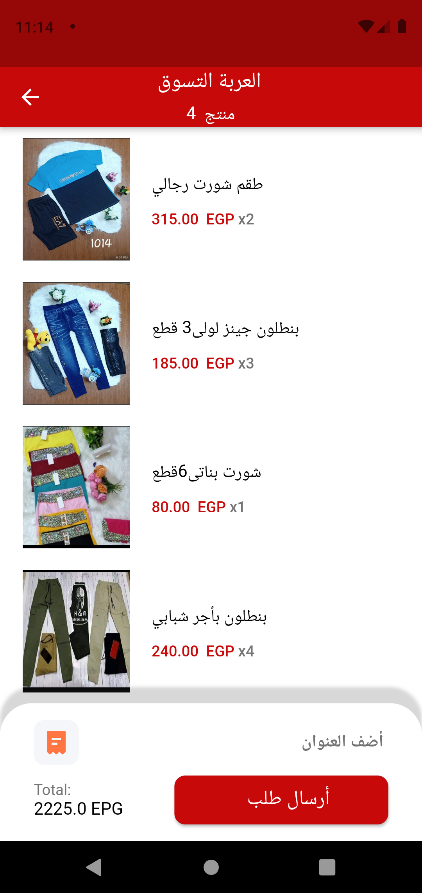
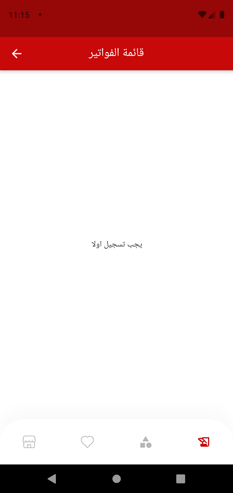

# Shopping_Show
This is Flutter project e-commerce .

## Getting Started


## Packages Used
```
  introduction_screen:
  firebase_core: ^1.3.0
  firebase_auth: ^1.4.1
  firebase_storage: ^8.1.3
  cloud_firestore:
  firebase_messaging:
  google_sign_in:
  google_mobile_ads:
  intl:
  date_time_format:
  flutter_svg:
  flutter_rating_bar:
  sqflite:
  simple_animations:
  flutter_automation:
  flutter_riverpod:
  flutter_card_swipper:
  image_picker: ^0.8.1+1
  websafe_svg:
  #flutter_login: ^2.1.0
  bloc:
  flutter_bloc:
  cupertino_icons: ^1.0.3
  flutter_launcher_icons:
  flutter_icons:
  android: "launcher_icon"
  ios: true
  image_path: "assets/images/log.png"
  provider: ^5.0.0

````


### Screenshots

<a href="https://play.google.com/store/apps/details?id=com.anany.panda1">

  
   
     
        

<div style="text-align: center" width="200"><table><tr>
  <td style="text-align: center">
  <a href="https://play.google.com/store/apps/details?id=com.anany.panda1">
    


